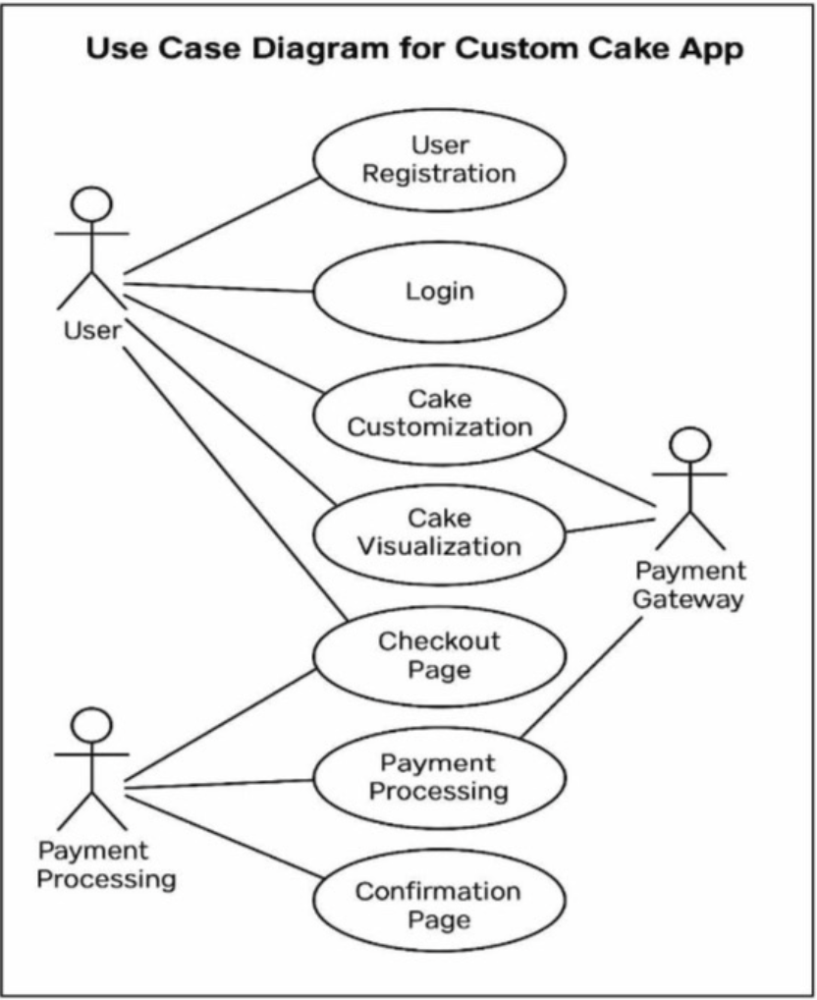

# 🍰 Cakelt - Custom Cake Ordering App
**Software Engineering Project | Prince Sattam bin Abdulaziz University**

## 📌 Project Overview
[cite_start]**Cakelt** is a specialized mobile application for a cake shop that bridges the gap between traditional bakeries and digital customization[cite: 2, 6]. [cite_start]It allows users to design their own cakes (flavors, fillings, decorations) and see a visual preview before ordering[cite: 7, 8].

### 🛠 The Problem We Solve
* [cite_start]**Limited Customization:** Traditional stores have fixed designs[cite: 10].
* [cite_start]**Communication Gap:** Ordering custom cakes via calls often leads to errors[cite: 11].
* [cite_start]**No Preview:** Customers cannot visualize their design before it's made[cite: 12].

---

## 📊 Requirements Analysis

### 1. Functional Requirements (High Priority)
| ID | Requirement | Description |
|----|-------------|-------------|
| R1 | User Registration | [cite_start]Create accounts to access features[cite: 27]. |
| R2 | Cake Customization | [cite_start]Select size, shape, flavors, and toppings[cite: 27]. |
| R3 | Visualization | [cite_start]Provides a 3D model or image preview[cite: 27]. |

### 2. Non-Functional Requirements
* [cite_start]**Usability:** Intuitive and user-friendly interface[cite: 29].
* [cite_start]**Performance:** Loads within 3 seconds[cite: 29].
* [cite_start]**Security:** Encrypted user data and secure payments[cite: 29].

---

## 🏗 System Design & Diagrams

### 🔹 Use Case Diagram
[cite_start]Our system identifies key interactions between the **User** and the **Payment Gateway**[cite: 32].

### 🔹 Sequence Diagrams
* [cite_start]**Order Flow:** Detailed interaction between the Customer, App Server, and Database[cite: 37].
* [cite_start]**Payment & Delivery:** Shows the integration with third-party delivery services[cite: 37].

---

## 🎨 User Interface (Prototype)
*Screenshots of the finalized UI design including the Cake Customizer and Checkout pages.*

  
  

---

## 👥 Project Team (Group 2)
* [cite_start]**Haneen Al saeed** 
* [cite_start]**Aljwharah Alhuqbane** 
* [cite_start]**Shahad Matrad** 
* [cite_start]**Tahani Alsamari**
